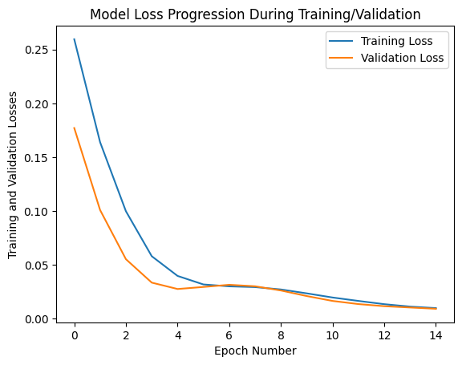
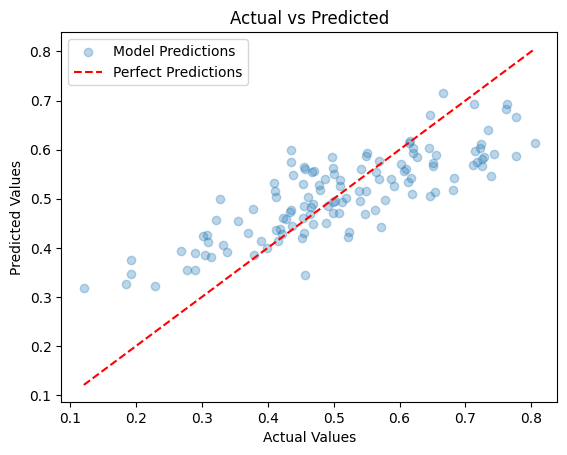

# car-sales-prediction

# Introduction

This project aims to predict the total dollar amount that customers are willing to pay for a car, given a list of customer features.

List of features:
- Customer Name
- Customer e-mail
- Country
- Gender
- Age
- Annual Salary
- Credit Card Debt
- Net Worth

This is a regression task since we are trying to predict the Purchase Amount. Regression works by predicting value of one variable Y (dependant variable) based on another variable X (independent variable). For exemple:

- The variation in family expenses on food as a result of the family's income level;
- The variation in credit card limit approval based on salary;
- The increase in crime rate associated with the rise in unemployment rate.

On this project, Artificial Neural Networks will be used to predict the Purchase Amount.

## Installation

To set up this project on your local machine, follow these steps:

1. Clone the repository

2. Navigate to the project directory

3. Install the required dependencies
    ```
    pip install -r requirements.txt
    ```


## Building the Artificial Neural Network with Keras

We build a model using Keras and add layers to it. The quantity of layers and neurons within those layers can greatly affect the model's performance and ability to generalize from the training data. The layers in between the input and output layers are known as hidden layers. Each layer attempts to learn different features of the dataset.

Obs:
- If you have too few layers, the network might not be able to learn complex patterns from the data (underfitting). 

- If you have too many layers, the network might start to learn not just the underlying patterns, but also the noise in the data (overfitting).


## Data Normalization

In the code, we use the `MinMaxScaler` class from the `sklearn.preprocessing` module to normalize our data. It transforms features by scaling each feature to a given range, typically between 0 and 1. This method first calculates the minimum and maximum value of each feature, and then transforms the feature to scale it between 0 and 1. This ensures that all features have the same scale, which can help the model converge more quickly and accurately. 

Here's how we use it in the code:
```python
scaler = MinMaxScaler()
X_scaled = scaler.fit_transform(X)
y_scaled = scaler.fit_transform(y.values.reshape(-1, 1))
```

## Model Training

The model is trained using the `model.fit()` function from Keras, which has the following parameters:

- `X_train`: The features training set. This is the data that the model learns from.
- `y_train`: The target training set. The model uses this data to learn the relationship between the features and the target variable.
- `epochs`: The number of times the model will see the entire training dataset. Each pass through the entire dataset is known as an epoch. The number of epochs is a hyperparameter that defines the number times that the learning algorithm will work through the entire training dataset.
- `batch_size`: The number of samples that will be propagated through the network at once. This is a hyperparameter that defines the number of samples to work through before updating the internal model parameters.
- `verbose`: This parameter controls the amount of information that is outputted during training. A value of 0 means silent, 1 means progress bar, and 2 means one line per epoch.
- `validation_split`: This is the percentage of the training data that will be used for validation. During training, we want to check the performance of our model on unseen data. So, we use part of our training data as validation data.

    ```python
    epochs_hist = model.fit(X_train, y_train, epochs=100, batch_size=50, verbose=1, validation_split=0.2)
    ```

#### Choosing Parameters
- `epochs`: Too many epochs can lead to overfitting of the training dataset, whereas too few may result in an underfit model. A good choice is to monitor the performance of the model during training and stop training when the performance on a holdout dataset starts to degrade.
- `batch_size`: Smaller batch sizes can be noisy, offering a regularizing effect and lower generalization error. Larger batch sizes offer more stable learning and convergence in the weights and a more accurate estimate of the gradient, but have the risk of not being able to escape from local minima. Experiment with different batch sizes and choose the one that offers the best trade-off between computational efficiency and model performance.
- `validation_split`: It's common to use 20-30% of the training data for validation. However, if you have a large dataset, you might need a smaller validation split. If your dataset is small, a larger split might be necessary.

#### Output
- `loss`: This is the value of the loss function for the training data. The model's objective is to minimize this function.

- `val_loss`: This is the value of the loss function for the validation data. After each epoch, the model checks its performance on the validation data, which gives you an idea of how well the model generalizes to unseen data.


## Evaluating Model Performance During Training and Validation

During the training process, the model's performance is evaluated on both the training data and the validation data. This allows us to monitor the model's learning progress.

In this code, `epochs_hist` is the History object returned by the `fit` method of the model. It contains the loss values at each epoch for both the training data (`epochs_hist.history['loss']`) and the validation data (`epochs_hist.history['val_loss']`).

The resulting plot shows how the model's loss decreases over time on both the training and validation data. If the model is learning well, both losses should decrease over time and converge to a similar value. If the validation loss starts to increase while the training loss continues to decrease, it might be a sign of overfitting.



## Models Predictions

The scatter plot chart below, compares the actual values of the target variable to the values predicted by the model. This chart help us to visualize the performance of the model.



Each point represents a sample from the test set. The x-coordinate of the point is the actual value of the target variable for that sample, and the y-coordinate is the value predicted by the model.
The red dashed line represents perfect predictions. If the model's predictions were perfect, all points would lie on this line.
The closer the points are to the red line, the better the model's predictions.

By looking at this chart, you can get a sense of how well the model is performing. If most points are close to the red line, it means the model's predictions are quite accurate. If the points are scattered far from the line, it indicates that the model's predictions are often off by a large margin.


## Predicting Purchase Amount for a New Customer

Once the model is trained, we can use it to predict the purchase amount for a new customer.

1. Create a new array with the customer's features. 
2. The features should be in the same order as in the training data ```]'Gender', 'Age', 'Annual Salary', 'Credit Card Debt', 'Net Worth']```
3. Your array will be something like this:
   ```python
   X_my_new_customer = np.array([[1, 25, 50000, 10000, 250000]])
   ```
4. In this example, the new customer is a 25-year-old female with an annual salary of $50,000, a credit card debt of $10,000, and a net worth of $250,000.
5. You can use the ```predict``` method of the model to predict the purchase amount:
    ```python
    y_predict = model.predict(X_my_new_customer)
    ```
6. The predict method returns a 2D array, so you can get the predicted purchase amount like this:
    ```python
    purchase_amount = int(y_predict[0][0])
    ```
7. Now you can print the predicted purchase amount:
    ```python
    print(f"New customer's Purchase Amount Prediction: USD {purchase_amount}")
    ```
